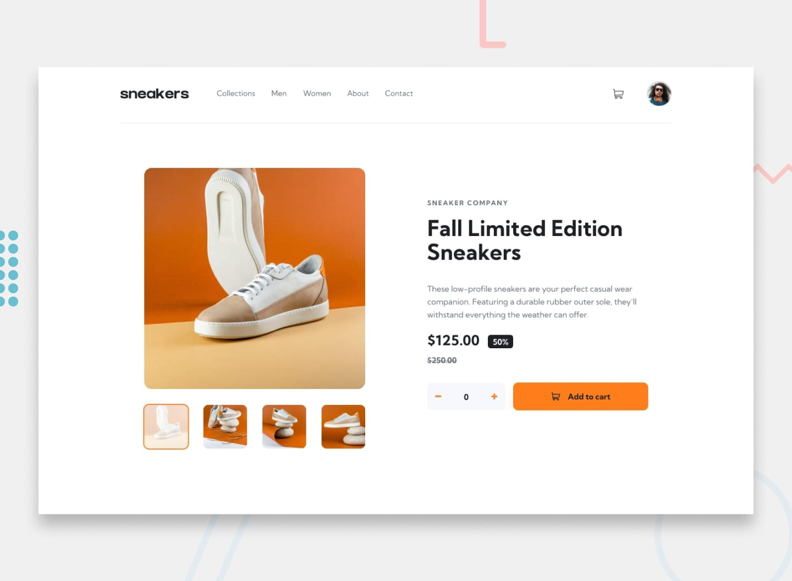

# E-commerce Product Page

A responsive e-commerce product page built with HTML, CSS, and JavaScript, based on a Frontend Mentor challenge.

The project focuses on building a realistic product-shopping experience with responsive layouts, accessible interactions, an image gallery, a lightbox, and a functional shopping cart.

**[Live Demo](https://sneakers-ecommerce-app.pages.dev/)**



## Features

* Fully responsive layout
* Responsive navigation menu
* Product image gallery
* Thumbnail-based image switching
* Full-screen product lightbox
* Add products to the shopping cart
* Increase and decrease product quantity
* Remove products from the cart
* Dynamic cart item count
* Hover, focus, and active states
* Semantic HTML and accessible interactive controls
* Responsive and optimized assets

## Built With

* HTML5
* CSS
* JavaScript
* PostCSS
* SVG icons
* Cloudflare Pages

## Project Structure

```text
├── assets/
├── src/
│   ├── css/
│   └── js/
├── public/
├── index.html
└── README.md
```

## What I Practiced

This project gave me the opportunity to move beyond static page implementation and work with interactive front-end functionality.

Some of the main areas I practiced were:

* Building responsive layouts from a design
* Structuring reusable CSS components
* Writing maintainable CSS with PostCSS
* Working with modern CSS features
* Managing UI state with vanilla JavaScript
* Building an accessible image gallery and dialog
* Creating a functional shopping cart
* Handling quantity changes and cart updates
* Improving touch targets and keyboard accessibility
* Optimizing images, icons, and other page assets
* Deploying a static site with Cloudflare Pages

## Accessibility

Accessibility was considered throughout the project, including:

* Semantic HTML elements
* Accessible button labels
* Keyboard-friendly interactive controls
* Visible focus states
* Appropriate ARIA attributes where needed
* Live announcements for dynamic cart information
* Sufficient touch target sizes for interactive controls

## Performance

The project was built with a focus on keeping the page lightweight and efficient.

This includes:

* Optimized image assets
* SVG icons instead of icon font dependencies
* Minimal JavaScript
* CSS processing and optimization
* Responsive image handling
* Avoiding unnecessary external dependencies

## Design

The original visual design and assets are from the [Frontend Mentor E-commerce Product Page challenge](https://www.frontendmentor.io/challenges/ecommerce-product-page-UPsZ9MJp6).

The implementation, structure, styling, interactions, and additional functionality were developed as part of my own front-end practice.

## Deployment

The project is deployed using [Cloudflare Pages](https://pages.cloudflare.com/).

**Live site:**
https://sneakers-ecommerce-app.pages.dev/

## Acknowledgements

* [Frontend Mentor](https://www.frontendmentor.io/) — original design challenge
* [Cloudflare Pages](https://pages.cloudflare.com/) — deployment

## License

This project was created for learning and portfolio purposes.
